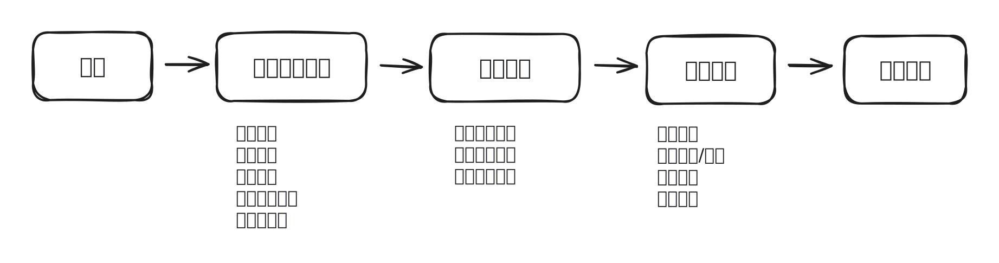

# 🌠 欢迎使用雁阵

### 雁阵的功能

雁阵是以**甘特图**为核心的可视化项目管理工具，通过雁阵进行完整的项目生命周期管理。


**什么甘特图？**

甘特图是是由[亨利·甘特](https://zh.wikipedia.org/wiki/%E4%BA%A8%E5%88%A9%C2%B7%E7%94%98%E7%89%B9)（Henry Laurence Gantt）于1910年开发出的一种条形图，用水平条形图显示任务的时间表和进度。每个条形代表一个任务，长度表示持续时间。通过可视化展示任务的开始、结束时间以及相互关系，团队可以迅速规划和沟通项目进展。甘特图被广泛应用于项目管理中，成为了一种直观、强大的项目管理工具。


<figure><figcaption></figcaption></figure>

### 雁阵的优点

#### 优秀的用户体验

* 雁阵提供了友好的用户界面，学习和使用的门槛很低，能够快速上手，轻松地创建和管理项目。
* 雁阵<mark style="color:purple;">**交互式甘特图**</mark>在行业中处于绝对领先地位。能够自动计算工期、汇总进度、通过基线对比追溯变更、通过任务依赖自动排期、丰富的时间轴刻度展示。

#### 长期更新和支持

* 雁阵2012年上线至今，持续更新与完善软件功能。
* 快速响应用户反馈。
