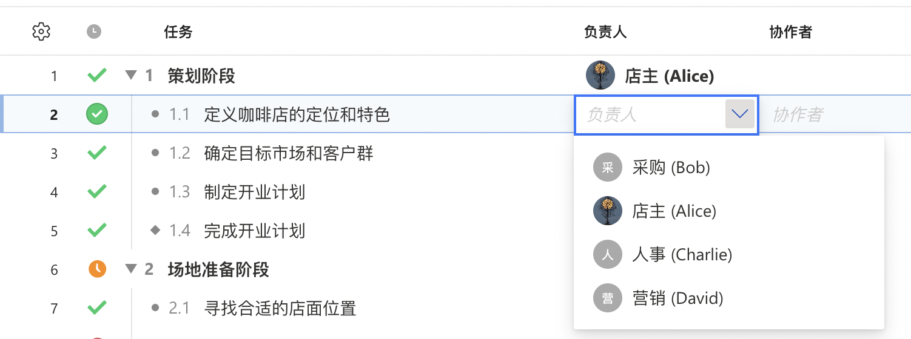

# 🚀 雁阵最佳实践

假如我们正在策划一个咖啡店的开业，以下是如何使用雁阵的最佳实践的案例：

### 项目背景

咖啡店开业项目包括筹备、装修、设备采购、员工培训和正式开业等阶段。

### 项目成员

店主(Alice)、人事经理(Charlie)、采购经理(Bob)、营销经理(David)

### 一. 创建项目

店主(Alice)创建一个新项目

<figure><figcaption>
新建项目菜单
</figcaption></figure>

<figure><figcaption>
新建项目窗口
</figcaption></figure>

### 二. 制定项目计划

制定项目计划是项目管理的重要步骤，涵盖了多项工作：创建任务列表、资源分配、任务排期。

在使用甘特图之前，先了解一下各种图例：

<figure><figcaption>
图例说明
</figcaption></figure>

#### 1. 创建任务列表

项目经理将项目拆分成几个阶段，再把阶段拆分更细分的任务。


**什么是WBS？**

WBS（Work Breakdown Structure），即工作分解结构，是将项目分解为可管理和可控制的任务和子任务的一种层次化结构。WBS有助于组织、规划和控制项目的各个方面，为项目管理提供了基础的、清晰的框架。


项目创建成功后进入甘特图页面，在该页面逐个创建任务

<figure><figcaption>
创建任务
</figcaption></figure>

在任务行上<mark style="background-color:yellow;">**点击右键**</mark>或者<mark style="background-color:yellow;">**菜单按钮**</mark>呼出任务菜单

<figure><figcaption>
任务操作菜单
</figcaption></figure>

#### 2. 任务分配

将任务分配给相关的负责人（唯一的）

<figure><figcaption>
设置负责人
</figcaption></figure>

如果项目需要多人协作执行，则可添加协作者（可多个）。

<figure><figcaption>
设置参与者
</figcaption></figure>

#### 3. 任务排期

设置任务的开始、结束日期。任务必须有明确的起止日期，这是保证项目可控的基础。设置任务排期的方式有两种：在左侧表格中通过日历选择或者在右侧甘特图中用鼠标拖拽设置。

#### 4. 设置任务依赖与里程碑

设置任务的开始、结束日期。任务必须有明确的起止日期，这是保证项目可控的基础。


**什么是任务依赖？**

任务依赖指的是项目管理中不同任务之间的相互关系。

目前雁阵仅支持**结束到开始（Finish-to-Start）**&#x7684;这种常见的依赖关系：表示一个任务的完成是另一个任务开始的先决条件。

例如，假设有一个工程项目，任务 A: 租赁店面，任务 B: 进行店面装修和布置。在这种情况下，任务 2必须等到任务 A完成后才可以开始。



**什么是里程碑任务？**

在项目管理中，里程碑（Milestone）是一些关键事件或阶段性的成就，用于标识项目的重要进展点。


最终完整的咖啡店开业项目计划是这样的：

<figure><figcaption>
咖啡店开业项目计划
</figcaption></figure>

### 三. 项目评审

项目经理将制定的项目计划提前几天给到各项目成员，然后再约定时间将每个任务过一遍，主要目的是明确每项任务的工作内容以及排期。如有工作冲突或者预估工期有偏差的情况，有针对性的进行调整。所有任务项确定后进入项目执行阶段。

### 四. 项目执行

:white\_check\_mark: **更新进度**

项目成员在“个人待办列表”中适时更新各自的任务进度。（团队协作模式）

项目经理在甘特图根据实际执行情况统一更新任务的进度（单人管理模式）

:calendar\_spiral: **调整计划**

项目经理根据实际的进展对计划进行调整，包括：排期调整和成员调整。

:speech\_balloon: **沟通与汇报**

定期与团队成员、利益相关者进行沟通，分享定期的项目状态报告。提供透明度，确保所有相关方了解项目的进展和问题。

### 五. 项目完成

* 完成所有任务。
* 收集项目数据和反馈。
* 进行项目总结与评估，以提取教训和改进未来项目的执行。
